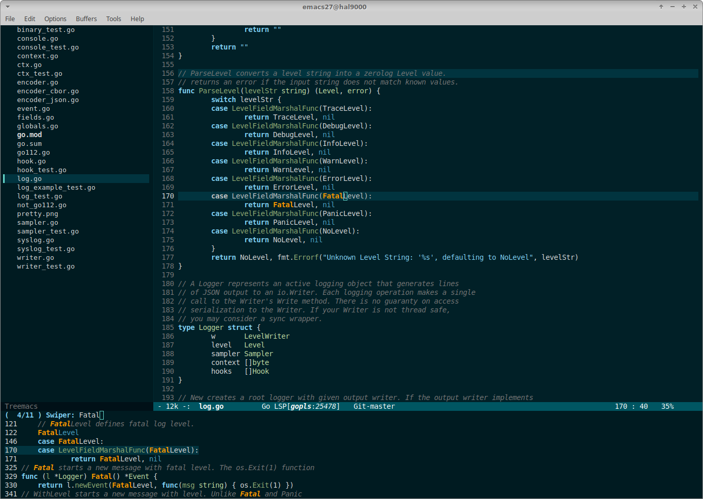

# emacs-immaterial-theme

*Note: for good results in a pure terminal environment, consider installing
Emacs 26 and [enable
truecolors](https://github.com/syl20bnr/spacemacs/wiki/Terminal) in your
terminal.*

Immaterial is an emacs color theme, loosely based on the principles of Google's
[Material
design](https://material.io/design/color/the-color-system.html#color-theme-creation). More
specifically, it defines (and allows users to _redefine_) the following coloring
elements:

- `background`: used for the background of buffers, modeline, etc.

  Comes in three flavors: `background-primary`, `background-on`,
  `background-off`. Most of the background will be colored using
  `background-primary`. `background-on` is used for highlighting or attracting
  attention (such as the active modeline, search candidates,
  etc). `background-off` is used to tone down parts of the screen (such as the
  inactive modeline in a split frame with several buffers).

  For dark themes, it is recommended to define `background-on` as a bit brigher
  than `background-primary`, and `background-off` as darker than
  `background-primary`.

- `foreground`: used for plain text and editor decorations of different kinds.

  Comes in three flavors: `foreground-primary`, `foreground-secondary`,
  `foreground-tertiary` with falling degree of use in the theme.

- `primary`: used for certain parts of the syntax highlighting (for example,
  keywords). Refer to [the code](immaterial-theme.el) for details.

  Comes in three variants, which are used to add some slight variation in the
  syntactic highlighting: `primary`, `primary-dark`, `primary-light`.

- `secondary`: used for certain parts of the syntax highlighting (for example,
  types and variables). Refer to [the code](immaterial-theme.el) for details.

  Comes in three variants, which are used to add some slight variation in the
  syntactic highlighting: `secondary`, `secondary-dark`, `secondary-light`.

- some additional colors for specific types of highlighting:

    - `error`: for highligting erroneous code.
    - `warning`: for highligting suspicious code.
    - `discrete`: for text that should be less pronounced (code comments, line
      numbers).
    - `cursor`: the color of the cursor.

The following are the full list of colors defined in the default
`immaterial-color-alist`:

 | Property               | Color                                                              |
 | --------               | -----                                                              |
 | `background-primary`   |  `#012027` |
 | `background-on`        |  `#01343f` |
 | `background-off`       |  `#001017` |
 | `foreground-primary`   |  `#dddddd` |
 | `foreground-secondary` |  `#c8c8c8` |
 | `foreground-tertiary`  |  `#b0b0b0` |
 | `primary`              |  `#9fa8da` |
 | `primary-light`        |  `#d1d9ff` |
 | `primary-dark`         |  `#6f79a8` |
 | `secondary`            |  `#c5e1a5` |
 | `secondary-light`      |  `#f8ffd7` |
 | `secondary-dark`       |  `#94af76` |
 | `error`                |  `#ff5555` |
 | `warning`              |  `#e86310` |
 | `discrete`             |  `#777777` |
 | `cursor`               |  `#64d8cb` |

Each of these values can be overridden through the
`immaterial-color-override-alist` variable, which overrides the defaults in the
`immaterial-color-alist`. As an example, to provide a different primary color
palette:

    (setq immaterial-color-override-alist
      '(("primary"         . "#ffa726")
        ("primary-light"   . "#ffd95b")
        ("primary-dark"    . "#c77800")
        ))

**Note**: it is highly recommended to make use of the [Material color
tool](https://material.io/tools/color) to experiment with color palettes and
variants of a certain color. For dark themes, less saturated colors (200 and
less) from the color palette improves readability.

**Note**: emacs [rainbow-mode](https://elpa.gnu.org/packages/rainbow-mode.html)
comes in handy for highlighting each hex color being edited in you emacs init
file.

## Screenshots

The default theme in `go-mode`:

With a background palette similar to the [Solarized dark
theme](https://ethanschoonover.com/solarized/).

    (setq immaterial-color-override-alist
      '(("background-primary" . "#002b36")
        ("background-on"      . "#003644")
        ("background-off"     . "#00212b")))

With an updated `primary` palette:

    (setq immaterial-color-override-alist
      '(("primary"         . "#81d4fa")
        ("primary-light"   . "#b6ffff")
        ("primary-dark"    . "#4ba3c7")))

## Install

- From MELPA (or MELPA stable) via:

        M-x package-install RET immaterial-theme
        (load-theme 'immaterial t)

- Via `use-package`:

        (use-package immaterial-theme
          :ensure t
          :config
          (load-theme 'immaterial t))

- By adding `immaterial-theme.el` to `~/.emacs.d/themes` and the following to
  your `init.el`:

        (add-to-list 'custom-theme-load-path "~/.emacs.d/themes")
        (load-theme 'immaterial t)
